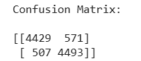
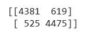
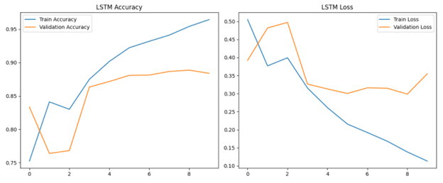
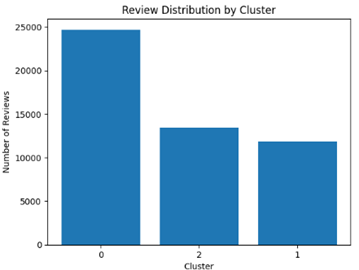
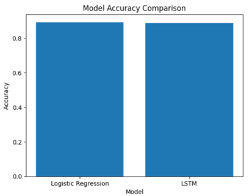
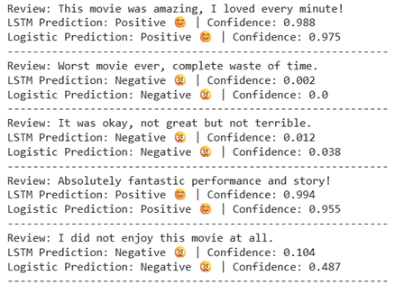

# IMDB Movie Review Sentiment Analysis

## Project Overview

This project analyzes IMDB movie reviews using natural language processing (NLP), machine learning, deep learning, and unsupervised learning techniques.

The objective is to classify movie reviews as positive or negative while comparing traditional machine learning approaches against deep learning models.

The project also applies clustering techniques to identify hidden textual patterns and thematic groupings within movie reviews.

---

## Business Problem

Sentiment analysis is widely used in:

- Customer feedback analysis
- Brand monitoring
- Product review analysis
- Decision support systems
- Social media analytics

This project evaluates whether deep learning models outperform traditional machine learning methods in sentiment classification tasks.

---

## Models Implemented

### Logistic Regression (Baseline Model)

- TF-IDF vectorization
- Traditional machine learning classifier
- Fast and interpretable baseline approach

### Bidirectional LSTM

- Deep learning recurrent neural network
- Captures sequential language patterns
- Context-aware sentiment classification

### K-Means Clustering

- Unsupervised learning model
- Identifies natural review groupings
- Discovers hidden textual themes

---

## Technologies Used

- Python
- Pandas
- NumPy
- Scikit-learn
- TensorFlow / Keras
- Matplotlib
- NLP Preprocessing
- TF-IDF Vectorization
- Deep Learning
- K-Means Clustering

---

## Key Results

| Model | Accuracy |
|---|---|
| Logistic Regression | ~89.2% |
| Bidirectional LSTM | ~88.6% |

Key findings:

- Logistic Regression slightly outperformed LSTM in overall accuracy
- LSTM demonstrated stronger contextual understanding
- Clustering identified meaningful thematic groupings within reviews
- Both approaches performed well on real-world sentiment examples

---

## Repository Structure

```text
notebooks/   -> Jupyter notebook implementation
reports/     -> Executive project report
images/      -> Project visualizations
data/        -> Dataset files
```

---

## Sample Visualizations

### Logistic Regression Confusion Matrix



Figure 1. Confusion matrix showing balanced sentiment classification performance for the Logistic Regression model.

---

### LSTM Confusion Matrix



Figure 2. Confusion matrix demonstrating strong positive and negative sentiment classification performance using the Bidirectional LSTM model.

---

### LSTM Training Performance



Figure 3. Training and validation accuracy/loss curves showing stable learning performance with minimal overfitting.

---

### Review Distribution by Cluster



Figure 4. K-Means clustering distribution identifying natural groupings of movie reviews based on textual patterns.

---

### Model Accuracy Comparison



Figure 5. Comparison of overall classification accuracy between Logistic Regression and Bidirectional LSTM models.

---

### Real-World Prediction Testing



Figure 6. Comparison of model predictions and confidence scores on custom real-world movie review examples.

---

## Author

Jose Reyes  
MS Business Analytics & Artificial Intelligence  
University of Texas Rio Grande Valley
